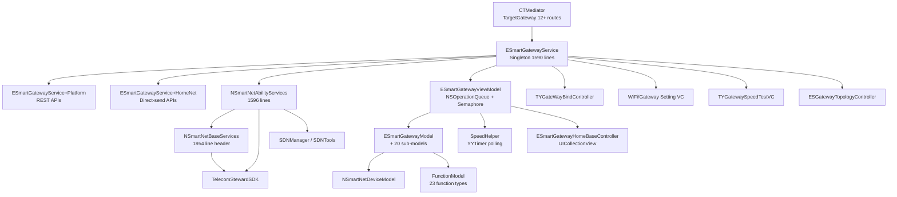
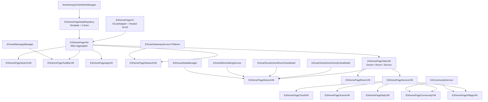
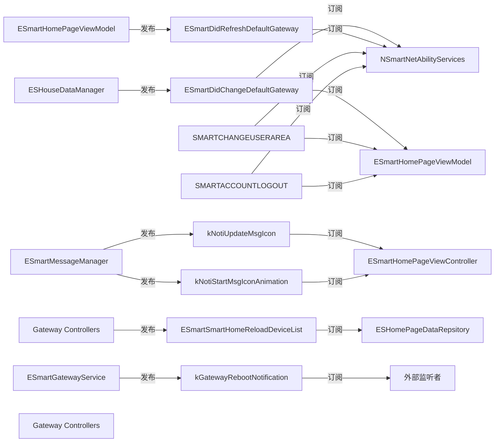
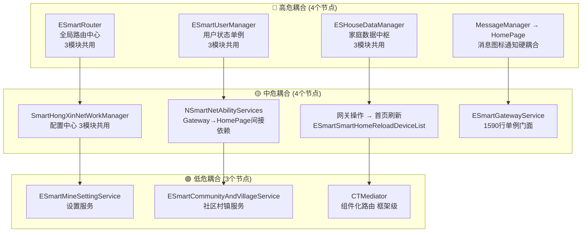
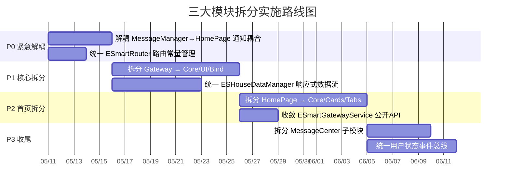

# 三大模块依赖关系图谱 (Mermaid)

> 可用支持 Mermaid 的工具（Typora、Obsidian、GitHub、Notion）打开此文件查看可视化图表。

---

## 1. 全局架构依赖图

```mermaid
graph TB
    subgraph Infrastructure["Infrastructure Layer"]
        Router[ESmartRouter]
        UserManager[ESmartUserManager]
        HouseData[ESHouseDataManager]
        ApiService[ESmartApiServiceBase]
        CTMediator[CTMediator]
        ConfigMgr[SmartHongXinNetWorkManager]
        NotifMgr[SmartNotificationManager]
        ReportMgr[ESReportManager]
        Cache[CacheTools]
        MineSetting[ESmartMineSettingService]
    end

    subgraph Gateway["Gateway 网关模块 (533 files)"]
        GW_Target[TargetGateway]
        GW_Service[ESmartGatewayService]
        GW_Ability[NSmartNetAbilityServices<br/>NSmartNetBaseServices]
        GW_VM[ESmartGatewayViewModel]
        GW_Model[ESmartGatewayModel]
        GW_UI[Controllers + Views]
        GW_SDK[TelecomStewardSDK<br/>SDN SDK]
        GW_Target --> GW_Service
        GW_Service --> GW_Ability
        GW_Ability --> GW_SDK
        GW_Service --> GW_VM
        GW_VM --> GW_Model
        GW_Model --> GW_UI
    end

    subgraph HomePage["HomePage 首页模块 (310 files)"]
        HP_Target[TargetHome]
        HP_VM5[ESmartHomePageViewModel<br/>5.x]
        HP_VM6[ESHomePageVM<br/>6.0]
        HP_Model[ESmartCardModel]
        HP_Repo[ESmartCardDataRepsitory<br/>ESHomePageDataRepsitory]
        HP_UI5[ESmartHomePageViewController<br/>+ Card Views]
        HP_UI6[ESHomePageVC<br/>+ Device/Room/Service Tabs]
        HP_Net[ESmartHomeRequest]
        HP_Popup[HomePagePopupTools<br/>HomePagePopupManager]
        HP_Target --> HP_VM5
        HP_VM6 --> HP_Repo
        HP_VM5 --> HP_Model
        HP_VM6 --> HP_Model
        HP_Model --> HP_UI5
        HP_Model --> HP_UI6
        HP_VM5 --> HP_Net
        HP_VM6 --> HP_Net
        HP_Popup --> HP_UI5
        HP_Popup --> HP_UI6
    end

    subgraph Message["MessageCenter 消息模块 (105 files)"]
        MC_Target[TargetMessage]
        MC_Mgr[ESmartMessageManager<br/>singleton + FMDB]
        MC_VM[MCMessagesViewModel<br/>MCSettingViewModel]
        MC_Model[MCMessageRecord<br/>MCMsgConfigModel]
        MC_UI[MCMainViewController<br/>MCMsgListViewController<br/>MCSettingViewController]
        MC_Push[ESmartPush / ESmartPushSDK]
        MC_Wechat[ESmartWechatPublicService<br/>+ WechatOpenSDK]
        MC_Target --> MC_Mgr
        MC_Mgr --> MC_VM
        MC_VM --> MC_Model
        MC_VM --> MC_UI
        MC_Mgr --> MC_Push
        MC_Mgr --> MC_Wechat
    end

    Router -.-> GW_Target
    Router -.-> HP_Target
    Router -.-> MC_Target
    UserManager -.-> GW_Service
    UserManager -.-> HP_VM5
    UserManager -.-> MC_Mgr
    HouseData -.-> GW_Service
    HouseData -.-> HP_VM5
    HouseData -.-> MC_VM
    ApiService -.-> GW_Service
    ApiService -.-> HP_Net
    ApiService -.-> MC_Mgr
    ConfigMgr -.-> GW_VM
    ConfigMgr -.-> HP_VM6
    ConfigMgr -.-> MC_UI
    NotifMgr -.-> GW_Service
    NotifMgr -.-> HP_VM5
    NotifMgr -.-> MC_Mgr

    GW_Service -. "kGatewayRebootNotification" .-> HP_VM5
    GW_UI -. "ESmartSmartHomeReloadDeviceList" .-> HP_VM6

    MC_Mgr -. "kNotiUpdateMsgIcon" .-> HP_UI5
    MC_Mgr -. "kNotiStartMsgIconAnimation" .-> HP_UI5

    HP_Target -. "actionBindFindGateway" .-> GW_Target
    HP_UI5 -. "ESmartGatewayService" .-> GW_Service
    HP_UI6 -. "ESmartGatewayService+Platform" .-> GW_Service
```



---

## 2. Gateway 模块内部数据流



---

## 3. HomePage 6.0 模块内部数据流



---

## 4. MessageCenter 模块内部数据流

```mermaid
graph TB
    Mediator[CTMediator<br/>TargetMessage 10 routes]
    Push[前台推送]

    MsgMgr[ESmartMessageManager<br/>singleton 2100+ lines]
    H5Bridge[MCH5SettingBridge]

    FMDB[FMDB SQLite<br/>{tyAccount_md5}_smart_message.db]

    BindToken[bind_token / unbind_token]
    GetConfig[get_user_config]
    GetMsgList[record_page_list]
    DeviceConfig[get/set_device_config]
    DNDConfig[get/set_disturb_config]
    WechatAPI[WeChat APIs]

    MsgVM[MCMessagesViewModel<br/>网络→FMDB→UI转换]
    SettingVM[MCSettingViewModel<br/>设置页数据工厂]

    MainVC[MCMainViewController]
    ListVC[MCMsgListViewController]
    EditVC[MCMsgEditViewController]
    SettingVC[MCSettingViewController]
    WechatVC[MCWeChatPublicInfoViewController]

    TPNS[TPNS SDK]
    Baichuan[百川 SDK]

    Mediator --> MsgMgr
    Push --> MsgMgr
    MsgMgr --> FMDB
    MsgMgr --> BindToken
    MsgMgr --> GetConfig
    MsgMgr --> GetMsgList
    MsgMgr --> DeviceConfig
    MsgMgr --> DNDConfig
    MsgMgr --> WechatAPI
    MsgMgr --> TPNS
    MsgMgr --> Baichuan

    FMDB --> MsgVM
    BindToken --> MsgVM
    GetConfig --> MsgVM
    GetMsgList --> MsgVM
    DeviceConfig --> SettingVM
    DNDConfig --> SettingVM
    WechatAPI --> WechatVC

    MsgVM --> ListVC
    MsgVM --> MainVC
    SettingVM --> SettingVC
    H5Bridge --> SettingVC
    H5Bridge --> MainVC
    MsgMgr --> EditVC
```

---

## 5. 跨模块通知依赖图



---

## 6. 耦合节点风险热力图



---

## 7. 拆分路线图



---

*使用支持 Mermaid 的编辑器打开此文件可渲染为交互式图表。*
